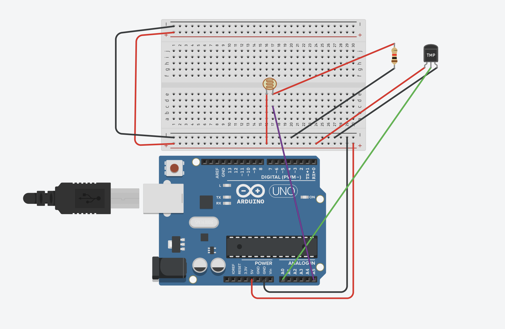

# Environmental Automatic System Design and Programming Application

## HW1 ([Task description](./環境自動化－作業一.pdf))

Use **TMP36** and **Photoresistor** to measure temperature on [Tinkercad](https://www.tinkercad.com).

